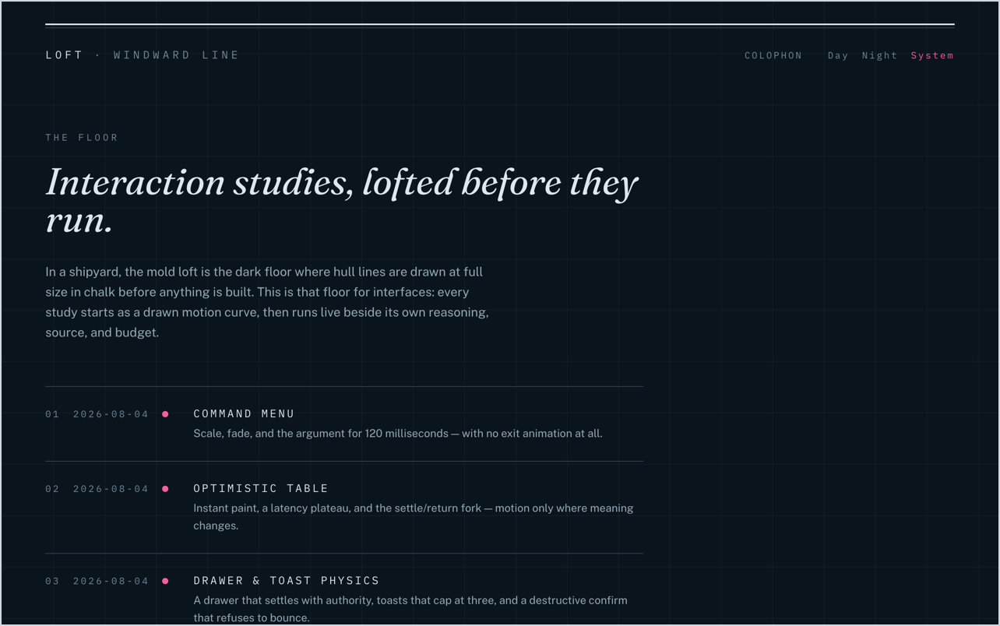

# Loft

Live: **[craft.windwardline.com](https://craft.windwardline.com)**



In a shipyard, the mold loft is the dark floor where hull lines are drawn at
full size in chalk before anything is built. This is that floor for
interfaces: every study starts as a drawn motion curve — the lofted line —
then runs live beside its own reasoning, source, and budget. The chart of
what shipped is at
[portfolio.windwardline.com](https://portfolio.windwardline.com); this is
where the lines get drawn.

## The study contract

Every study renders seven slots in a fixed order the suite asserts: eyebrow
(date · number · a magenta dot when interactive) → thesis (the page's one
serif line) → the lofted line → the live demo → three to five argued notes,
always including one *when not to animate* → the actual source → a footer
strip naming its accessibility contract, reduced-motion behavior, and
interaction budget in milliseconds. The lofted line draws itself in pure
CSS, so it runs without JavaScript and lands complete under reduced motion.

## What holds it

- **A token contract:** the family palette lives in `src/lib/palette.ts`;
  the suite pins every name and exact hex in both modes, and the colophon
  renders from the same module — the page and CI cannot disagree quietly.
- **A contrast suite:** every text token measured against both grounds, both
  modes, at WCAG AA. It caught its first real defect before any CSS existed
  (day chalk-faint, corrected and recorded).
- **Behavior and axe checks** on every study: focus traps, inert
  backgrounds, live regions, reduced-motion branches — asserted, not
  assumed. 58 tests; typecheck, lint, tests, and build gate every push.

## Structure

```
src/app/              the floor, /study/[slug], /colophon
src/components/       LoftedLine, StudyShell, SourcePane, Lamp
src/lib/              palette (the contract), registry, lamp, reduced-motion
src/studies/<slug>/   one folder per study: logic, island, lofted line
tests/                the machinery described above
docs/superpowers/     the approved design spec and implementation plan
```

## Local development

```bash
npm install
npm run dev        # http://localhost:3000
npm test           # the full suite
npm run typecheck  # tsc --noEmit (run next typegen or a build first)
npm run build
```

Deployed on Vercel; pushes to `main` deploy to production. Security headers
live in `vercel.json`; fonts and every other asset are self-hosted.
